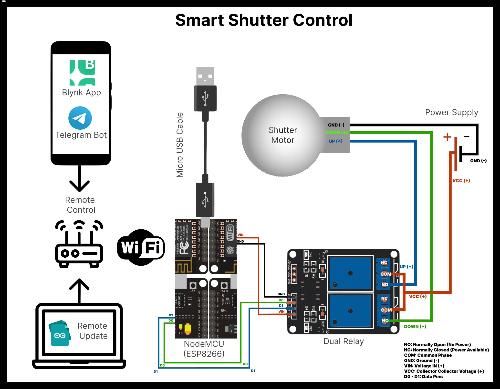

# 🏠 Kepenk Kontrol Projesi 🏠

Bu proje, mobil cihazlardan otomatik panjurları kablosuz olarak yönetmek için bir IoT projesidir. 📱💻 Panjurlarınızı Blynk uygulaması ve Telegram API aracılığıyla kolayca kontrol edebilirsiniz. Projede NodeMCU (ESP8266) mikrodenetleyici kartı kullanılmış ve Arduino IDE üzerinde geliştirilmiştir. Ayrıca, OTA (Over-The-Air) güncelleme özelliği sayesinde kablosuz güncellemeler yapabilirsiniz. 🌐✨

## Proje Hedefleri 🎯

Bu projenin temel amacı, kullanıcıların evlerindeki panjurları uzaktan ve kolayca kontrol edebilmelerini sağlamaktır. Panjurları açıp kapama, zamanlayıcılar oluşturma gibi temel fonksiyonlar projede bulunmaktadır. 🔒📲

## Gereksinimler 🛠️🔧

Bu projeyi çalıştırmak için aşağıdaki bileşenlere ihtiyacınız vardır:
- NodeMCU (ESP8266) mikrodenetleyici kartı
- Arduino IDE
- Blynk uygulaması (mobil cihazınıza indirebilirsiniz)
- Telegram API (Telegram BotFather üzerinden bir bot oluşturmanız gerekmektedir) 🤖🌟

## Kullanım 🚀

1. Arduino IDE'yi bilgisayarınıza indirin ve kurun.
2. NodeMCU (ESP8266) mikrodenetleyici kartınızı hazırlayın ve Arduino IDE üzerinden bağlantı kurun.
3. Gerekli kütüphaneleri ve paketleri projenize ekleyin.
4. Bu projenin kodlarını Arduino IDE'ye yükleyin.
5. Blynk uygulamasını mobil cihazınıza indirin ve projeniz için bir hesap oluşturun.
6. Blynk uygulaması veya Telegram API ile projenizi bağlayın.
7. Panjurlarınızı mobil cihazınızdan kablosuz olarak kontrol edebilirsiniz! 🎉📱

Projedeki "BOTtoken" ve "CHAT_ID" kısımlarını kendi Telegram botunuzun token ve chat ID'siyle değiştirmeniz gerekmektedir. 🔑📝

## Kütüphaneler ve İşlevleri 📚🔧

Projede kullanılan kütüphaneler ve işlevleri şunlardır:

1. BlynkSimpleEsp8266: ESP8266 tabanlı cihazların Blynk platformu ile iletişim kurmasını sağlar.

2. UniversalTelegramBot: Telegram botunun işlevlerini gerçekleştirmek için kullanılır. Telegram API ile iletişim kurarak gelen mesajları okur ve komutları işler.

3. ArduinoJson: JSON verilerini işlemek ve oluşturmak için kullanılır. Telegram botundan gelen mesajların JSON formatında olduğu durumlar için bu kütüphane kullanılır.

4. ESP8266WiFi: ESP8266 modülünün WiFi özelliklerini kullanmak için kullanılır. WiFi ağına bağlanma ve iletişim için gerekli işlevleri sağlar.

5. ESP8266mDNS: ESP8266 modülünün mDNS (Multicast DNS) özelliğini kullanmak için kullanılır. Bu sayede cihaza bir isim atayarak, cihazın ağ üzerinde daha kolay erişilebilmesini sağlar.

6. WiFiUdp: UDP (User Datagram Protocol) üzerinden veri gönderme ve alma işlemleri için kullanılır. ArduinoOTA kütüphanesi tarafından OTA güncellemeleri için kullanılır.

7. ArduinoOTA: OTA (Over-The-Air) güncelleme özelliğini kullanmak için kullanılır. Kablosuz olarak yeni kodları cihaza yüklemek için OTA desteği sağlar.

8. WiFiClientSecure: Güvenli bir şekilde WiFi ile iletişim kurmak için kullanılır. HTTPS protokolü gibi güvenli bağlantılar oluşturmak için kullanılır.

## Özellikler 🌟⌨️

Projede aşağıdaki özellikler bulunmaktadır:
- Mobil uygulamadan panjurları açma ve kapama 🔄
- Otomatik zamanlayıcılar oluşturma 🕒
- Uzaktan kontrol (Blynk ve Telegram API entegrasyonu) 📲💬
- OTA güncelleme desteği ile kablosuz güncellemeler 📡

## Bağlantı Şeması

## Lisans
Bu proje [MIT Lisansı](LICENSE) ile lisanslanmıştır.

## İletişim ve Destek 📧🤝

Eğer projeye ilişkin herhangi bir sorunuz, öneriniz veya destek talebiniz varsa, lütfen bize ulaşmaktan çekinmeyin. Aşağıdaki iletişim bilgileri üzerinden bize ulaşabilirsiniz. Destek vermekten mutluluk duyarız! 📬🚀

* E-posta: [derinonursahin@gmail.com](mailto:derinonursahin@gmail.com)

**Teşekkürler! 🙌**

# EN

# 🏠 Shutter Control Project 🏠

This project is an IoT project that allows you to wirelessly control automatic shutters from mobile devices. 📱💻 You can easily control your shutters using the Blynk application and the Telegram API. The project uses the NodeMCU (ESP8266) microcontroller board and is developed on the Arduino IDE. Additionally, it supports Over-The-Air (OTA) updates for wireless firmware updates. 🌐✨

## Project Objectives 🎯

The main objective of this project is to enable users to remotely and easily control shutters in their homes. Basic functions such as opening and closing shutters and creating timers are included in the project. 🔒📲

## Requirements 🛠️🔧

To run this project, you will need the following components:
- NodeMCU (ESP8266) microcontroller board
- Arduino IDE
- Blynk application (you can download it to your mobile device)
- Telegram API (you need to create a bot through Telegram BotFather) 🤖🌟

## Usage 🚀

1. Download and install Arduino IDE on your computer.
2. Prepare your NodeMCU (ESP8266) microcontroller board and establish a connection with Arduino IDE.
3. Add the required libraries and packages to your project.
4. Upload the code of this project to Arduino IDE.
5. Download the Blynk application to your mobile device and create an account for your project.
6. Connect your project to the Blynk application or the Telegram API.
7. You can now wirelessly control your shutters from your mobile device! 🎉📱

You need to replace the "BOTtoken" and "CHAT_ID" parts in the code with the token and chat ID of your own Telegram bot. 🔑📝

## Libraries and Functions 📚🔧

The project utilizes the following libraries and functions:

1. BlynkSimpleEsp8266: Enables ESP8266-based devices to communicate with the Blynk platform.
2. UniversalTelegramBot: Used to perform functions of the Telegram bot. It reads incoming messages and processes commands by communicating with the Telegram API.
3. ArduinoJson: Used for processing and generating JSON data. This library is used for cases where incoming messages from the Telegram bot are in JSON format.
4. ESP8266WiFi: Used to utilize WiFi features of the ESP8266 module. It provides the necessary functions for connecting to WiFi networks and communication.
5. ESP8266mDNS: Used to use the mDNS (Multicast DNS) feature of the ESP8266 module. This allows assigning a name to the device, making it easier to access the device on the network.
6. WiFiUdp: Used for sending and receiving data over UDP (User Datagram Protocol). It is used by the ArduinoOTA library for OTA updates.
7. ArduinoOTA: Used for OTA (Over-The-Air) updates. It provides OTA support to wirelessly load new code onto the device.
8. WiFiClientSecure: Used to securely communicate over WiFi. It is used to establish secure connections like HTTPS.

## Features 🌟⌨️

The project includes the following features:
- Opening and closing shutters from the mobile application 🔄
- Automatic timer creation 🕒
- Remote control (integration with Blynk and Telegram API) 📲💬
- OTA updates for wireless firmware updates 📡

## Connection Diagram

## License

This project is licensed under the [MIT License](LICENSE).

## Contact and Support 📧🤝

If you have any questions, suggestions, or need support related to the project, please feel free to reach out to us. You can contact us using the following information. We would be happy to provide assistance! 📬🚀

* Email: [derinonursahin@gmail.com](mailto:derinonursahin@gmail.com)

**Thank you! 🙌**

